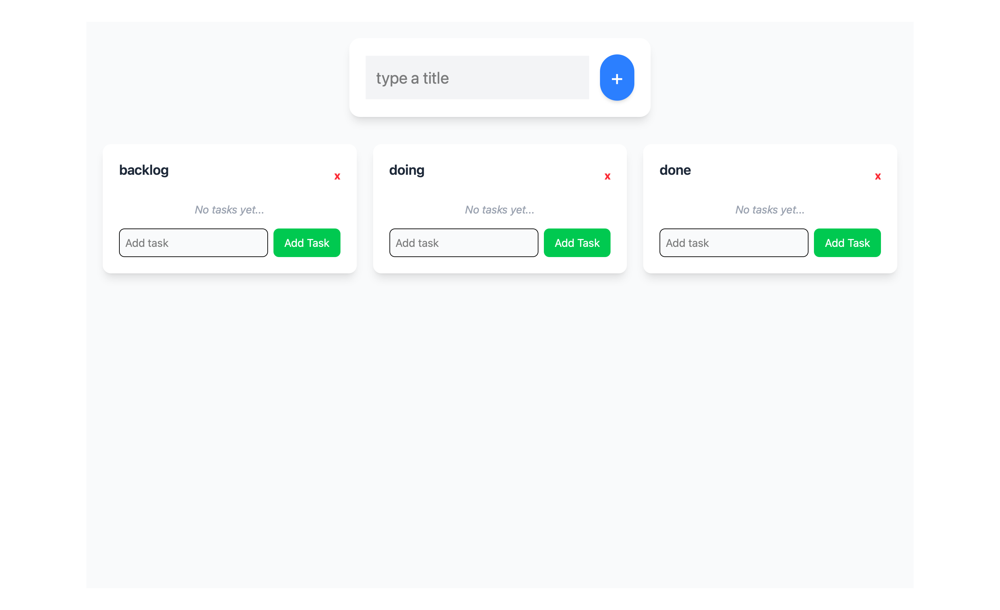

# 📝 Kanban board




> A simple kanban board built with **React** and **Tailwind CSS**. Create sections, add tasks, and remove them when completed! ✅

---

## 🚀 Features

- Create multiple **sections** (e.g., "Backlog", "In progress")
- Add and delete **tasks** in each section
- **Responsive design** with Tailwind CSS
- Clean and modern **UI/UX**

---

## 🛠️ Technologies

- **React** – Frontend framework
- **Tailwind CSS** – Styling
- **JavaScript (ES6)** – Functionality
- **Date.now()** – Unique IDs for tasks and sections

---

## 📦 Installation

1. Clone the repo:  
   ```bash
   git clone https://github.com/JohannesL2/kanban-board.git

2. Navigate to the project folder:
   ```bash
   cd kanban-board

3. Install dependencies:
   ```bash
   npm install

4. Start the development server:
   ```bash
   npm run dev

5. Open http://localhost:5173 in your browser
